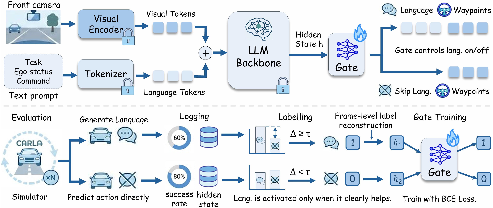
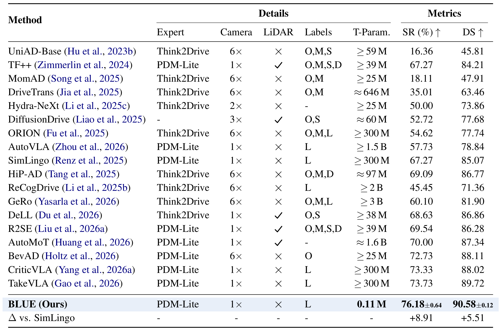
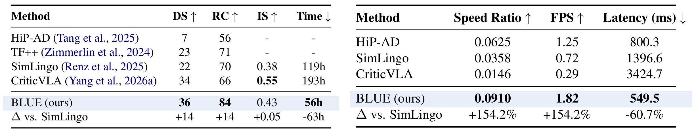

# BLUE: Toward Better Language Use in Efficient Vision-Language-Action Models for Autonomous Driving

[](https://blue-website.github.io/)
[](https://arxiv.org/abs/2606.08684)
[](https://huggingface.co/George-Ling/blue_gate)
[](https://huggingface.co/datasets/George-Ling/blue_data)
[](https://huggingface.co/George-Ling/blue_gate/tree/main/evaluation_logs)

This repository is the official codebase for BLUE: Toward Better Language Use in Efficient Vision-Language-Action Models for Autonomous Driving.

TLDR: Driving VLAs often generate language reasoning that is useless or even harmful to driving. 
BLUE addresses this by generating language only when it clearly helps, thereby improving driving performance while reducing inference latency.

BLUE uses a 0.11M-parameter gate to decide at each frame whether to predict driving actions with or without intermediate language generation.

## 🎉 News

2026-06 - We released the [Project Page](https://blue-website.github.io). It includes some demo videos. 🎉Please check it!

2026-06 - We released the BLUE [evaluation code](gate/evaluation/eval_blue_full.sh), [model checkpoints](gate/weights/blue_simlingo_gate.pt), and [evaluation logs](evaluation_logs/bench2drive/bench2drive_merged_2.json). 🎉Please try it!

## ⚙️ Environment Setup

Create a Python environment and install the packages listed in `requirements.txt`.

```bash
module load conda
conda create -n blue python=3.8 -y
conda activate blue
python -m pip install -r requirements.txt
```

Install CARLA 0.9.15 from the official CARLA release page:
[[CARLA 0.9.15]](https://github.com/carla-simulator/carla/releases/tag/0.9.15)

After installation, set the CARLA root to the directory that contains:

```text
CarlaUE4.sh
PythonAPI/carla/
```

## 📦 Weight Download

The BLUE gate checkpoint is already included in this repository at
[`gate/weights/blue_simlingo_gate.pt`](gate/weights/blue_simlingo_gate.pt).

To use the SimLingo backbone, download the checkpoint from the official
[SimLingo repository](https://huggingface.co/RenzKa/simlingo/tree/main/simlingo/checkpoints/epoch%3D013.ckpt), then pass the local
`pytorch_model.pt` path through `--agent-config` when running evaluation.

You can verify bundled assets with:

```bash
python scripts/verify_assets.py
```

Model checkpoints and evaluation logs will also be mirrored on Hugging Face:
[[Weights]](https://huggingface.co/George-Ling/blue_gate) | [[Data]](https://huggingface.co/datasets/George-Ling/blue_data)

## 🚀 Quick Start

#### Static checks

```bash
cd blue
module load conda
conda activate blue

bash -n gate/evaluation/eval_blue_full.sh
python scripts/verify_assets.py
python tests/smoke/test_result_summary.py
python tests/smoke/test_gate_checkpoint.py
```

#### One-route closed-loop smoke test

```bash
cd blue
module load conda
conda activate blue

bash gate/evaluation/eval_blue_full.sh \
  --route-range 0:1 \
  --agent-config /path/to/pytorch_model.pt \
  --carla-root /path/to/carla \
  --out-dir outputs/blue_eval_smoke
```

## 📁 Repository Map

```text
blue/
├── data/
│   ├── README.md                         # data release status and layout
│   └── routes/bench2drive_split/         # 220 Bench2Drive route XMLs
├── gate/
│   ├── evaluation/eval_blue_full.sh      # closed-loop evaluation entry point
│   ├── runtime/                          # decision-log utilities
│   └── weights/                          # BLUE gate checkpoint
├── simlingo_training/models/
│   ├── gate.py                           # BLUE gate runtime
│   └── driving_gate.py                   # SimLingo gate integration
├── team_code/agent_simlingo.py           # Bench2Drive agent
├── Bench2Drive/                          # evaluator components
├── evaluation_logs/                      # released evaluation logs
├── configs/                              # asset and evaluation configs
├── docs/                                 # auxiliary notes
├── tests/smoke/                          # smoke tests
└── requirements.txt                      # package snapshot
```

## 📊 Framework and Results

### Framework



### Results on Bench2Drive



### Results on Longest & Latency Comparison



## 🧭 Open-Source Plan

- [x] Stage 1: release evaluation code, model checkpoints, and evaluation logs.
- [ ] Stage 2: release training data and training code.

## 🙏 Acknowledgements

BLUE builds on [SimLingo](https://github.com/RenzKa/simlingo),
[CriticVLA](https://arxiv.org/abs/2604.27366),
[Bench2Drive](https://github.com/Thinklab-SJTU/Bench2Drive), and
[CARLA](https://github.com/carla-simulator/carla). Please follow the original
licenses and attribution terms for all upstream components.
